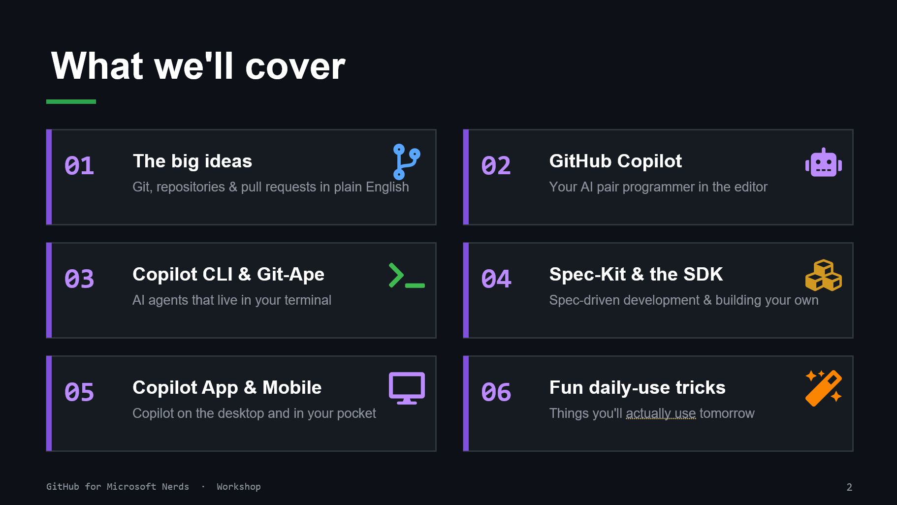

# 01. What We'll Cover

## Workshop flow

1. The big ideas: Git, repos, pull requests in plain language.
1. GitHub Copilot: AI pair programming in the editor.
1. Copilot CLI and Git-Ape: AI in the terminal.
1. Spec-Kit and SDK: spec-driven workflows and custom agents.
1. Copilot app and mobile: workflows beyond the editor.
1. Daily-use tricks: practical wins for tomorrow morning.

## Suggested pace

- 10 minutes for concepts
- 25 minutes for tools and setup
- 20 minutes for hands-on practice
- 5 minutes for wrap-up and resource links
