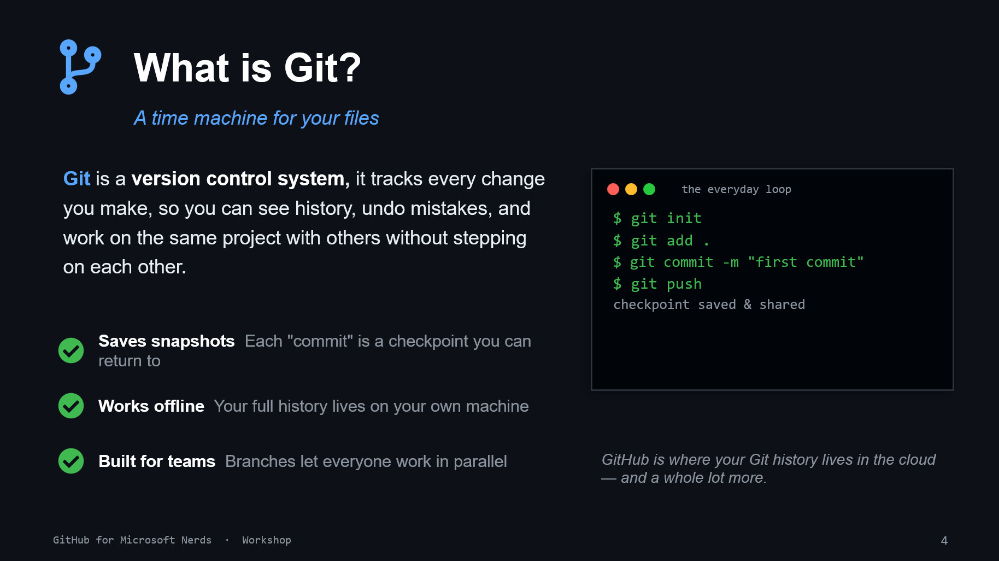

# 03. What Is Git?

## What attendees should understand

Git is a version control system that keeps a timeline of your file changes.

- every commit is a checkpoint
- you can inspect and undo safely
- branches let teams work in parallel

## Try it now

1. Run `git init` in a test folder.
1. Create one file and commit it.
1. Change the file and commit again.
1. Use `git log --oneline` to view the timeline.
