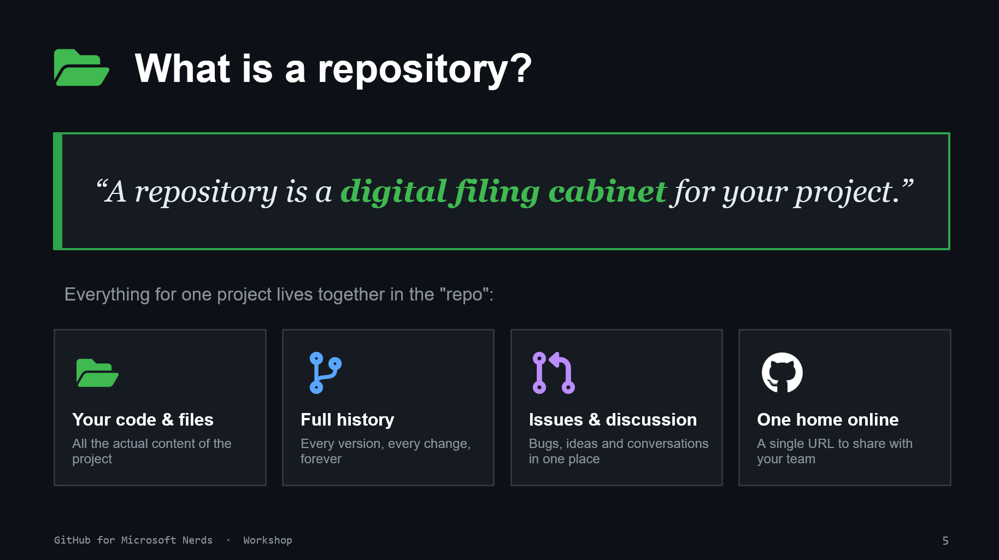

# 04. What Is a Repository?

## Simple explanation

A repository is a digital filing cabinet for one project.

It contains:

- your files and folders
- full change history
- issues and discussions
- a shareable online home for collaboration

## Try it now

Create a new repository and add:

- a short README
- one issue describing a small improvement
- one branch for the improvement
