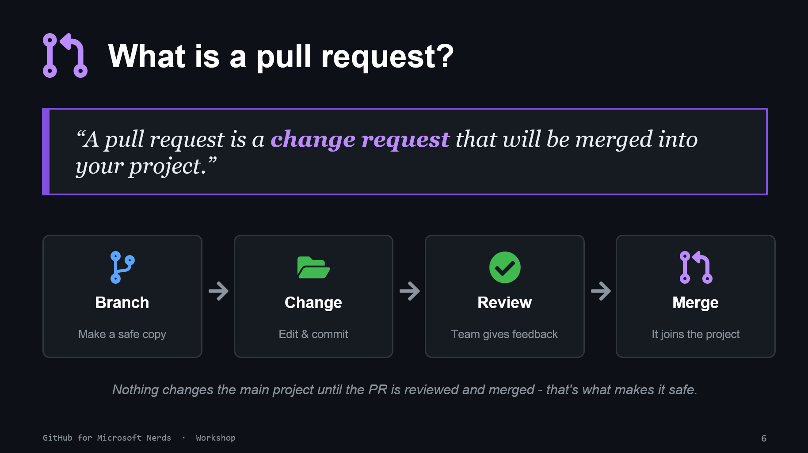

# 05. What Is a Pull Request?

## Simple explanation

A pull request is a proposed change that gets reviewed before merge.

Workflow:

1. branch
1. change and commit
1. review and feedback
1. merge

## Why teams love PRs

- safer delivery to main
- clear audit trail
- shared ownership and learning

## Try it now

Open a small PR with one documentation change and request one reviewer.
