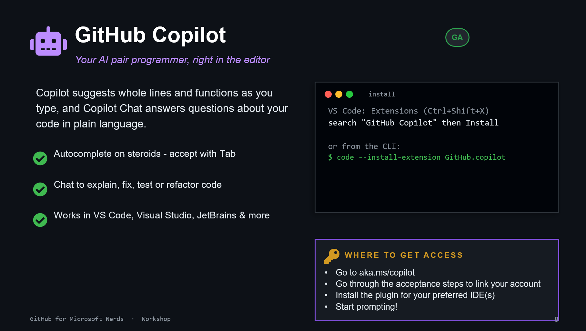

# 07. GitHub Copilot

## What it does

GitHub Copilot assists while you code:

- inline suggestions as you type
- chat for explain, fix, test, and refactor tasks
- support across popular IDEs

## Install and access

- VS Code: install the GitHub Copilot extension
- CLI: `code --install-extension GitHub.copilot`
- Access and onboarding: [aka.ms/copilot](https://aka.ms/copilot)

## Exercise

Open any function and ask Copilot Chat to:

1. explain it for a new teammate
1. propose one test case
1. suggest one refactor
