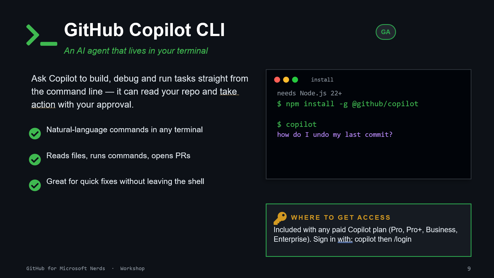

# 08. GitHub Copilot CLI

## What it does

Copilot CLI brings natural-language assistance into your terminal.

- asks and executes command suggestions
- reads repository context with your approval
- helps with quick fixes without leaving shell workflows

## Install and access

1. Ensure Node.js 22+.
1. Install (latest verified in this repo): `npm install -g @github/copilot@1.0.59`
1. Sign in: `copilot auth login`

Included with paid Copilot plans.

Version note: this chapter was updated against the latest package metadata on 2026-06-05.

## Exercise

Ask Copilot CLI:

- "How do I undo my last commit but keep the files?"
- "Find all markdown files larger than 10KB"
