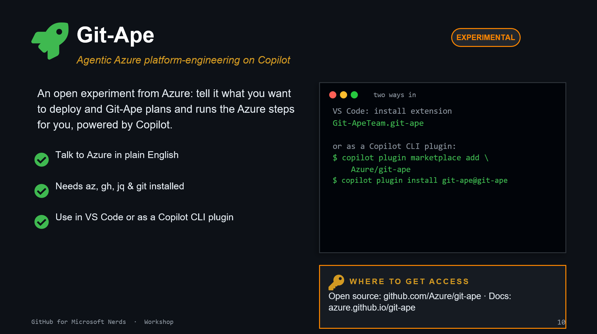

# 09. Git-Ape

## What it is

Git-Ape is an open experiment for agentic Azure platform engineering on Copilot.

## Install and access

- VS Code extension: `Git-ApeTeam.git-ape`
- CLI plugin setup:
  - `copilot plugin marketplace add Azure/git-ape`
  - `copilot plugin install git-ape@git-ape`
- Repo: [github.com/Azure/git-ape](https://github.com/Azure/git-ape)
- Docs: [azure.github.io/git-ape](https://azure.github.io/git-ape)

## Prerequisites

- Azure CLI (`az`), GitHub CLI (`gh`), `jq`, and `git`

## Exercise

Write one plain-English deployment request and inspect the generated plan before applying.
