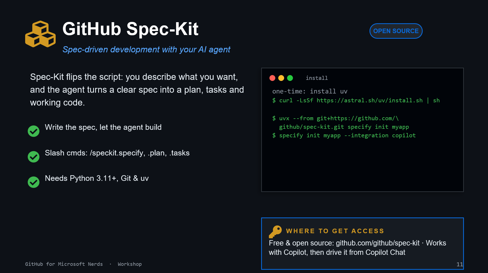

# 10. GitHub Spec-Kit

## What it is

Spec-Kit helps you describe the outcome first, then generate plan, tasks, and implementation steps.

## Install and access

1. Install uv (one time): `curl -LsSf https://astral.sh/uv/install.sh | sh`
1. Run: `uvx --from git+https://github.com/github/spec-kit.git specify init myapp`
1. Optional integration mode: `specify init myapp --integration copilot`

Project link: [github.com/github/spec-kit](https://github.com/github/spec-kit)

## Exercise

Pick one small internal tool idea and write a spec in plain language, then generate initial tasks.
