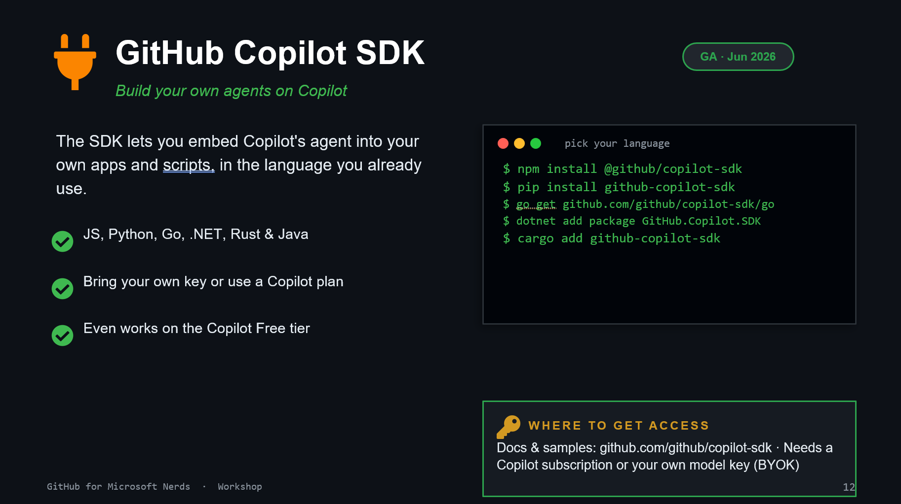

# 11. GitHub Copilot SDK

## What it is

The SDK lets you embed Copilot-powered agents in your own apps and scripts.

Supported ecosystems include JavaScript, Python, Go, .NET, Rust, and Java.

## Install examples

- JavaScript: `npm install @github/copilot-sdk`
- Python: `pip install github-copilot-sdk`
- .NET: `dotnet add package GitHub.Copilot.SDK`

Docs and samples: [github.com/github/copilot-sdk](https://github.com/github/copilot-sdk)

## Exercise

Create a tiny script that calls one Copilot SDK feature and logs the result in your terminal.
