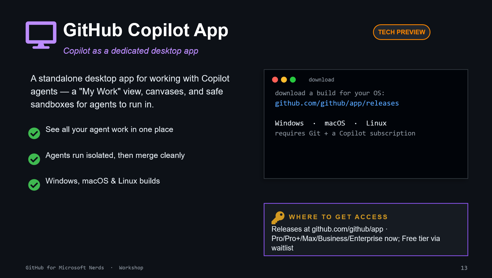

# 12. GitHub Copilot App

## What it is

A dedicated desktop experience for Copilot workflows with canvases and isolated agent runs.

## Install and access

- Releases: [github.com/github/app/releases](https://github.com/github/app/releases)
- Platforms: Windows, macOS, Linux
- Availability: tech preview at time of workshop deck

## Exercise

Open one repo in the app, create one agent task, then compare the result with your IDE workflow.
