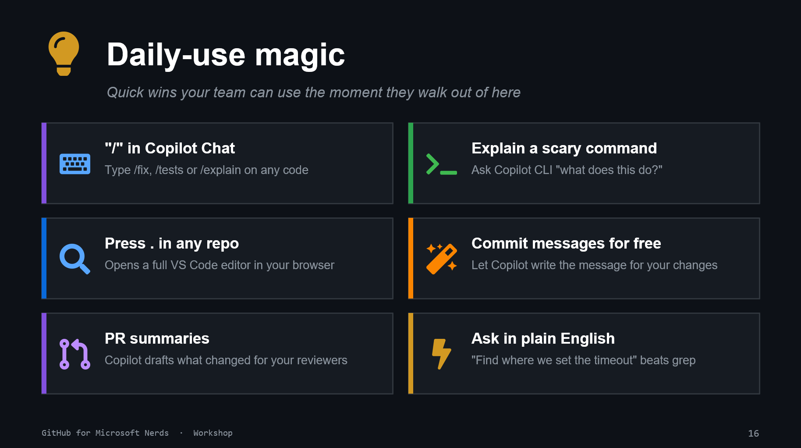

# 15. Daily-use Magic

## Six fast wins from the slide

1. Use slash commands in Copilot Chat like `/fix` and `/tests`.
1. Ask Copilot CLI to explain risky commands before running them.
1. Press `.` in any GitHub repo to open web-based editing.
1. Let Copilot draft commit messages.
1. Use PR summaries to speed reviewer understanding.
1. Ask in plain English when searching a codebase.

## Practice sprint

Timebox this to 10 minutes:

- complete three of the six wins
- share one favorite with the group
