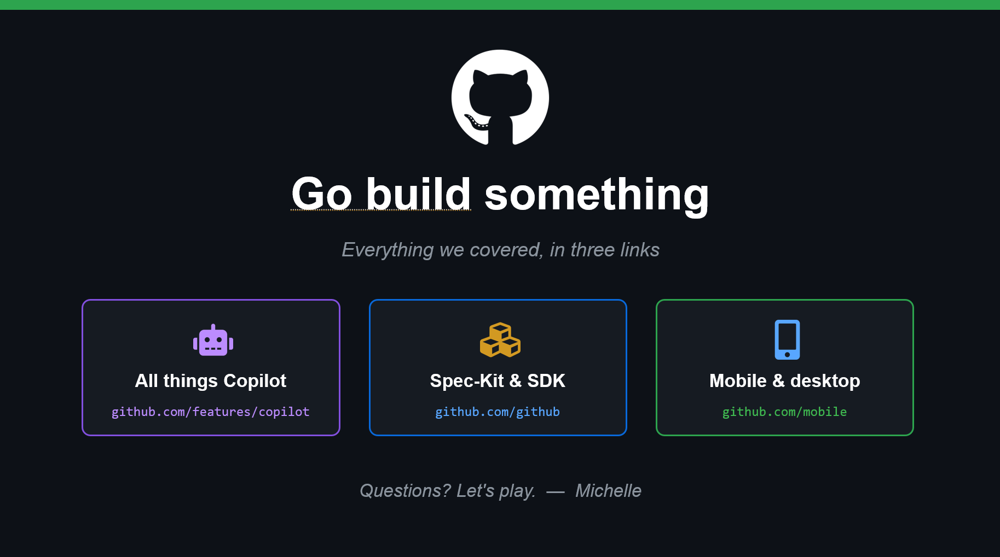

# 16. Go Build Something

## Wrap-up

The deck closes with three practical link buckets:

- all things Copilot
- Spec-Kit and SDK
- mobile and desktop access

## Final exercise

Build a tiny end-to-end workflow in your own repo:

1. create a branch
1. use Copilot to implement one small change
1. open a PR with a clear summary
1. merge and post the result in workshop chat

Then bookmark the [Resources](../resources.md) chapter for ongoing use.
