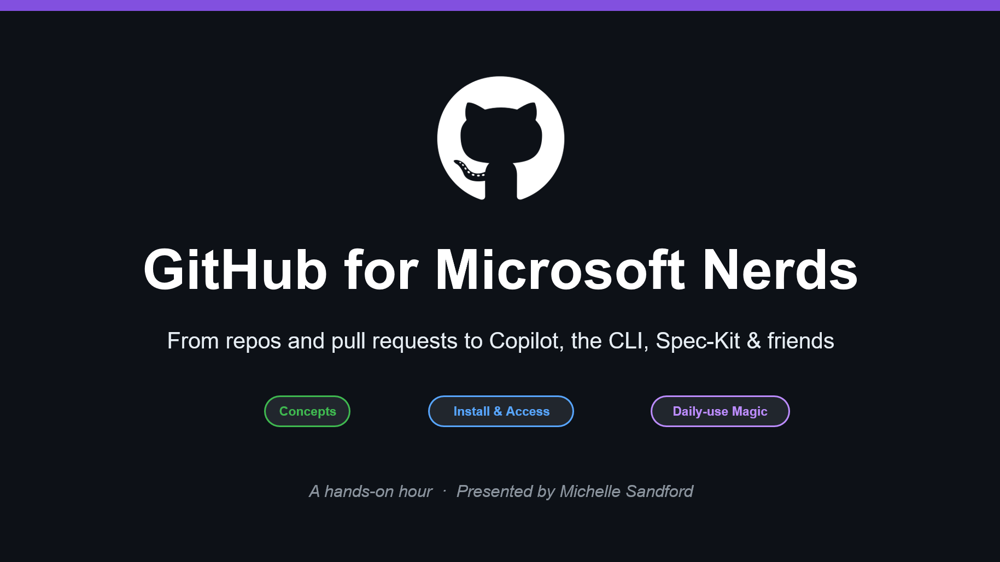

# GitHub for Microsoft Nerds

From repos and pull requests to Copilot, CLI, Spec-Kit, and friends.

## Workshop map

This site mirrors your slide deck and turns each slide into a chapter with:

- a hero image from the deck
- plain-language explanation for attendees
- install and access details where needed
- small hands-on exercises to practice right away

## Quick start for attendees

1. Bring a GitHub account and sign in.
1. Install Git and VS Code.
1. Open the chapter that matches the current workshop section.
1. Complete the exercise blocks as you go.

## Chapter shortcuts

- [Part 1: Big ideas](chapters/02-big-ideas.md)
- [Part 2: Install and access](chapters/06-tools.md)
- [Part 3: Useful day to day](chapters/14-fun-things.md)
- [Resources and links](resources.md)

## Accessibility notes

- Use the theme toggle in the header to switch between high-contrast dark and light modes.
- All chapter hero images include descriptive alt text.
- Sections are organized with semantic headings for screen reader navigation.
